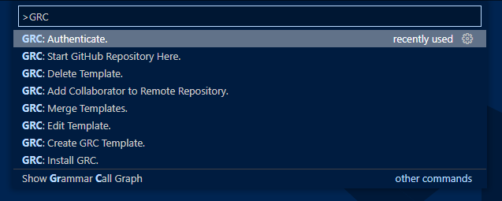
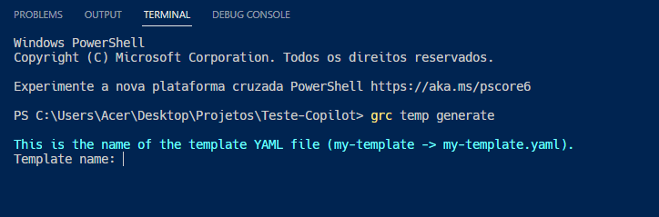
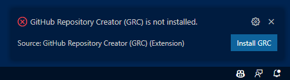
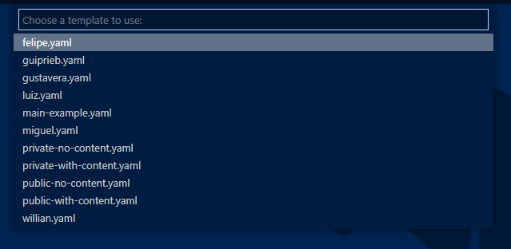
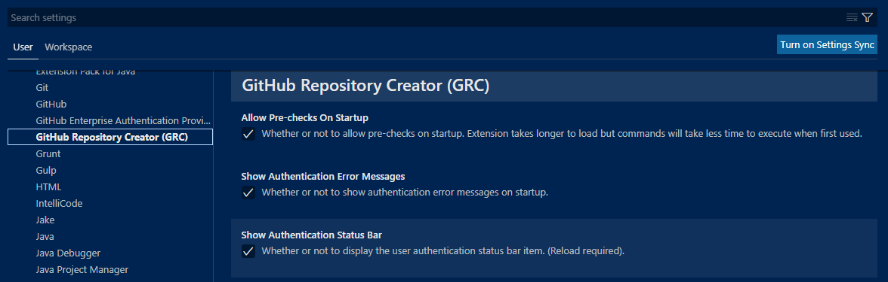

<h1 align="center">GRC VSCode Extension</h1>

An extension for using [GRC](https://github.com/ArthurSudbrackIbarra/GitHub-Repo-Creator) inside Visual Studio Code. Automatically start GitHub repositories in your current workspace.
 

## Table of Contents

- [Download](#download)
- [Features](#features)
  - [GRC: Add Collaborator to Remote Repository](#grc-add-collaborator-to-remote-repository)
  - [GRC: Authenticate](#grc-authenticate)
  - [GRC: Create Template](#grc-create-template)
  - [GRC: Install GRC](#grc-install-grc)
  - [GRC: Start GitHub Repository Here](#grc-start-github-repository-here)
- [Configurations](#configurations)
- [Requirements](#requirements)
- [Known Issues](#known-issues)
- [Release Notes](#release-notes)
  - [0.0.1](#001)
  - [0.0.2](#002)
  - [0.0.3](#003)

## Download

You can download GRC extension here: https://marketplace.visualstudio.com/items?itemName=ArthurSudbrackIbarra.grc.

## Features

Bellow, all the GRC extension features will be listed. To use commands, open the command pallete with:

- `Ctrl` + `Shift` + `p`
- `⌘` + `Shift` + `p`

    

### GRC: Add Collaborator to Remote Repository

Use this command to add a collaborator to one of your remote GitHub repositories. You'll be asked to enter the repository name, the collaborator name and the permission of the collaborator.

    

### GRC: Authenticate

Use this command to authenticate to GitHub with GRC. You must use this command before using any other commands that involve interaction with your GitHub account.

    

### GRC: Create Template

Use this command to create a GRC template. Visual Studio Code will open a terminal instance and run the `grc temp generate` command for you.

    

### GRC: Install GRC

Use this command to install GRC in your machine in case you don't have it yet. You'll be asked to choose the directory where GRC will be installed.

    

### GRC: Start GitHub Repository Here

Use this command to create a remote GitHub repository and then connect your current workspace to it. The extension will list your GRC templates and ask you to choose a template, as well as the repository name and the repository description.

    

## Configurations

You can change GRC Configurations by clicking Settings -> Extensions -> GitHub Repository Creator (GRC).

- `grc.showAuthenticationErrorMessages`: Whether or not to show authentication error messages on startup.

- `grc.showAuthenticationStatusBar`: Whether or not to display the user authentication status bar item. (Reload required).

- `"grc.allowPre-checksOnStartup"`: Whether or not to allow pre-checks on startup. Extension takes longer to load but commands will take less time to execute when first used.

    

## Requirements

In order to use GRC extension, you need to have GRC installed in your machine. Fortunately, You can download it through the extension with the [install-grc](#grc-install-grc) command. You can also follow the [installation guide](https://github.com/ArthurSudbrackIbarra/GitHub-Repo-Creator#installation-windows) of the official GRC repository.

| GRC Version | Compatible GRC Extension Version |
| :---------: | :------------------------------: |
|   v3.0.1    |              v0.0.1              |
|   v3.0.2    |              v0.0.2              |
|   v3.0.3    |              v0.0.3              |

## Known Issues

This extension was tested on Windows 10, Ubuntu 22.04 and macOS. Therefore, the extension might have bugs or not work in other operating systems. If you find any problems, feel free to contact the [publisher](mailto:arthur.ibarra@edu.pucrs.br).

## Release Notes

GRC release notes:

### 0.0.1

Commands added:

- Add Collaborator
- Authenticate
- Install GRC
- Start Repository commands.

### 0.0.2

Commands added:

- Create GRC Template

User Experience:

- Added possibility to update GRC through the extension.
- Better feedback regarding the user being authenticated or not.

Technical Changes:

- More robust validations. GRC is installed, GRC version is correct, user is authenticated, workspace is not already a git repository.

### 0.0.3

- GRC extension is now working on Ubuntu and macOS, it was not working previously.

- GRC installation is now done through a Visual Studio Code terminal (more feedback).

- Added status bar item that shows if the user is authenticated or not.

- Added customizable configurations to the extension.
